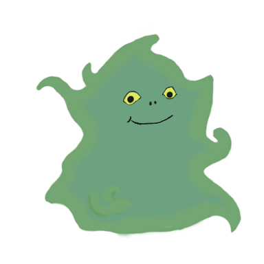

# CHANGELING
## A wonderdraft profile manager

Changeling manages profiles for wonderdraft based on provided .yml configuration files.
It provides an easy to use command line interface to offer its functionality

A sample configuration file for changeling can look like this

### Profile example

````yaml
name: dungeon
modules:
  - "Dungeon Architecture"
  - "Dungeon Interior"
````

The modules listed, correspond to top level folders in the wonderdraft asset directory.
Right now changeling assumes that wonderdraft uses its standard directory for assets. That 
will be configurable in a later release.

### Installation
If you use the official releases of changeling [click here](https://github.com/trashtatur/changeling/releases/), you shouldn't need an installation of python.
If you build from sourcecode, you will!

Changeling can be installed easily by using the official releases, or by cloning this github repository and installing
python on your local machine (docker functionality might come later...).

#### Using official release

Head over to releases and download the zip file that says something like **changeling_X.X** where X are
numbers indicating versions. You are advised to pick the latest one.

After downloading, unpack it where ever you want and execute the start.bat file. From there you can use
the command ``changeling`` to start you off. (Hint: You can only use the ``changeling setup`` command
in the beginning, after that all is open to you)

#### Cloning and bulding from sourcecode:
Clone and or download the code from this github repository. I will assume you know how to do that if you
chose this step.

Then change into the downloaded repository and type the following:
``pip install --editable .``

After that you'll be able to use changeling in the commandline by typing ``changeling``.
It'll show you its available commands. In the beginning it'll just be a setup command

### Disclaimer

changeling is still in a really early release. I won't be responsible for any damage to your
wonderdraft assets or installation or whatever else. If you need support, create an issue or
contact me on the wonderdraft discord / reddit . It is nearly feature complete for now tho.
Might add more stuff later!